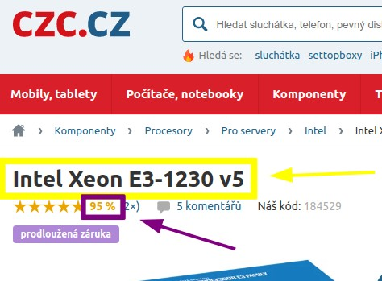

### ZADÁNÍ

- Udělej fork tohoto repozitáře (https://github.com/hptroniccz/hpt-test-grabber).
- Následující dva úkoly proveď postupně jako jednotlivé commity.
- Použij kód kompatibilní s PHP 7.3.

1. Naprogramuj aplikaci pro zjištění ceny produktu na CZC.cz. Vstup může být jeden nebo více kódů výrobce zboží. 
    1. Vstupní bod aplikace je soubor [run.php](run.php) a spuštění metody run() instance třídy [Dispatcher](Dispatcher.php).
    1. Vstupní data jsou v plaintext formě v souboru [vstup.txt](vstup.txt) (co řádek, to položka).
    1. Výstup na stdout ve formátu JSON (viz [vzor.json](vzor.json)).
   
    

1. Rozšiř aplikaci z bodu 1, aby získávala i název produktu a jeho procentuální hodnocení. Odpovídajícím způsobem rozšiř výstupní data.

    
